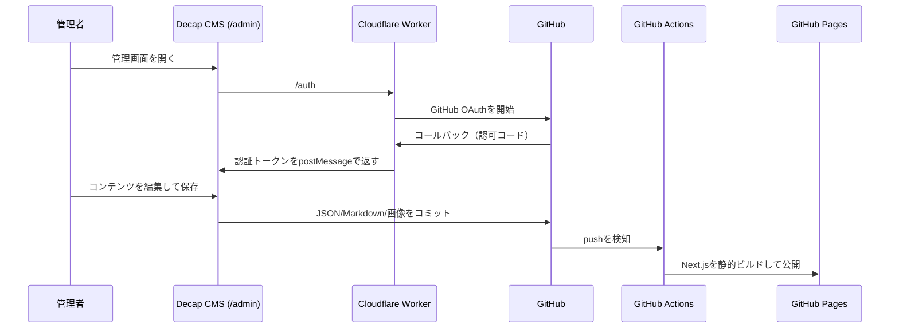

# 静的サイトに管理画面を実装する

## GitHub Pages・Decap CMS・Cloudflare Workersによる個人サイト運用

個人ポートフォリオやブログでは、公開は高速で安価な静的ホスティングを使いつつ、記事・プロフィール・実績などはブラウザから編集したい場面がある。本書では、GitHub Pagesを公開先にし、Decap CMSを管理画面として導入し、GitHub OAuthをCloudflare Workersで仲介する構成を解説する。

この構成の特徴は、コンテンツをデータベースではなくGitリポジトリ内のJSON・Markdown・画像として保持する点にある。変更履歴はGitHubに残り、CMSで保存すると自動コミットされ、GitHub Actionsによって静的サイトが再公開される。

## 1. 全体像



公開サイトはGitHub Pages上の静的HTML・CSS・JavaScriptだけで動く。パスワードやClient Secretを公開側へ置かず、認証で必要な秘密情報はCloudflare WorkerのSecretにだけ保存する。

## 2. 採用技術

| 役割 | 技術 |
| --- | --- |
| サイト生成 | Next.js（`output: 'export'`） |
| 公開 | GitHub Pages |
| 管理画面 | Decap CMS |
| 認証 | GitHub OAuth App |
| OAuth仲介 | Cloudflare Workers |
| コンテンツ保存 | GitHubリポジトリのJSON・Markdown・アップロードファイル |
| 自動公開 | GitHub Actions |
| 外部記事同期 | GitHub Actionsの定期実行 |

## 3. なぜGitベースCMSなのか

一般的なCMSはデータベースにコンテンツを保存する。一方、GitベースCMSでは、コンテンツ自体をリポジトリに保存する。

利点は次のとおり。

- 変更履歴・差分・復元がGitHubで完結する
- 静的ホスティングとの相性がよい
- バックアップが特別に不要
- CMSを使わず、コードエディタで直接編集することもできる
- 個人サイトなら無料枠で運用しやすい

代わりに、保存後の再ビルドを待つ必要があり、複数人が同時に同じファイルを編集するとGitの競合が起こり得る。

## 4. コンテンツの設計

このプロジェクトでは、画面に直接文章を埋め込まず、`content/`配下へ分割している。

```text
content/
├── profile.json        # 氏名・自己紹介
├── site.json           # Hero、About、Contact、SNSなどの共通文言
├── projects.json       # プロジェクトと技術記事
├── presentations.json  # 登壇資料
├── slides.json         # Heroスライド画像
├── resources.json      # Resourcesページの見出し
├── blog.json           # 個人ブログからの自動同期結果
├── qiita.json          # Qiitaからの自動同期結果
└── zenn.json           # Zennからの自動同期結果
```

ページはこれらのファイルをimportして静的生成する。例えばプロジェクトを追加すると、Works一覧、HomeのPick up、プロジェクト詳細ページが同じデータを参照する。表示箇所ごとに内容を二重管理しないことが重要である。

## 5. Decap CMSの設定

Decap CMSは`public/admin/`に置く。`index.html`がCMS本体を読み込み、`config.yml`が編集可能なデータとGitHub連携先を定義する。

```yml
backend:
  name: github
  repo: KTaisei/official
  branch: main
  base_url: https://YOUR-WORKER.workers.dev
  auth_endpoint: auth

media_folder: public/uploads
public_folder: /official/uploads
```

`media_folder`はリポジトリ上の保存先、`public_folder`は公開ページからの参照先である。GitHub Pagesのプロジェクトサイトは`/リポジトリ名/`配下で公開されるため、ここでは`/official/uploads`と指定している。

### 管理画面で編集するもの

- プロフィール、Aboutの経歴、Contact情報
- Heroのテキストとスライド画像
- プロジェクト、技術記事、使用技術
- 登壇資料のタイトル・概要・PDFファイル
- Resourcesページの見出し
- フッターのSNSリンクと著作権表記

個人ブログ・Qiita・Zennの記事一覧は外部サービスを正とするため、CMSでは編集せず自動同期する。

## 6. GitHub OAuthとCloudflare Worker

GitHub Pagesは静的ホスティングであり、OAuth Client Secretを安全に保管したり、認可コードをアクセストークンへ交換したりできない。そこでCloudflare WorkerをOAuthの仲介役にする。

Workerが保持するSecretは以下である。

```text
GITHUB_CLIENT_ID
GITHUB_CLIENT_SECRET
ALLOWED_GITHUB_LOGIN
```

`ALLOWED_GITHUB_LOGIN`に指定したGitHubユーザー名と、ログインしたユーザーの`login`が一致する場合だけ、CMSへトークンを返す。これにより、サイトが公開されていても管理画面で保存できる人を限定できる。

Workerの役割は三つに分かれる。

1. `/auth`でGitHubの認可画面へ遷移する
2. `/callback`で認可コードをアクセストークンへ交換する
3. GitHub APIの`/user`でログイン名を検証し、Decap CMSのポップアップへ結果を返す

Decap CMSとの通信では、ポップアップが`authorizing:github`を送信し、管理画面からの応答を受けてから次の形式でトークンを返す。

```js
window.opener.postMessage(
  `authorization:github:success:${JSON.stringify({ token, provider: 'github' })}`,
  event.origin,
)
```

このハンドシェイクがないと、GitHubで認証が成功していても管理画面側がログイン完了を認識できない。

## 7. GitHub OAuth Appの登録

GitHubの`Settings` → `Developer settings` → `OAuth Apps`でOAuth Appを作成する。

- Homepage URL: ポートフォリオの公開URL
- Authorization callback URL: `https://YOUR-WORKER.workers.dev/callback`

作成後、Client IDとClient SecretをCloudflare Workerへ登録する。

```bash
cd worker
npx wrangler secret put GITHUB_CLIENT_ID
npx wrangler secret put GITHUB_CLIENT_SECRET
npx wrangler secret put ALLOWED_GITHUB_LOGIN
npx wrangler deploy
```

Secretを`wrangler.toml`、JSON、GitHub Actionsのログ、ブラウザ用JavaScriptに書いてはいけない。

## 8. GitHub Pagesへの公開

Next.jsをGitHub Pagesへ公開する場合、静的エクスポートを使う。

```ts
const nextConfig = {
  output: 'export',
  trailingSlash: true,
  basePath: process.env.NEXT_PUBLIC_BASE_PATH || undefined,
}
```

リポジトリ名が`official`なら、プロジェクトサイトのURLは`https://ktaisei.github.io/official/`になる。そのためGitHub Actions内で次を指定する。

```yml
- run: npm run build
  env:
    NEXT_PUBLIC_BASE_PATH: /official
```

`basePath`を設定しないと、CSS、JavaScript、画像、アップロードPDFへの参照が`/`から始まり、GitHub Pagesでは404になりやすい。

## 9. 外部記事の自動同期

`scripts/sync-blog.mjs`は次の情報源を取得する。

| 情報源 | 取得方法 | 保存先 |
| --- | --- | --- |
| 個人ブログ | 公開HTMLの投稿一覧 | `content/blog.json` |
| Qiita | Qiita API | `content/qiita.json` |
| Zenn | RSSフィード | `content/zenn.json` |

GitHub Actionsでは6時間ごとにこのスクリプトを実行する。

```yml
on:
  schedule:
    - cron: '17 */6 * * *'
```

新しい記事があれば同期JSONを更新し、GitHub Actionsがコミット・ビルド・Pages公開まで行う。公開サイトが外部サービスのAPIを毎回直接呼ばないため、CORSや表示速度の問題を避けられる。

## 10. 運用時の注意

### 管理画面とローカル作業を併用する場合

CMS保存はGitHub上の`main`へ直接コミットされる。ローカルでも同じファイルを編集していると、pull時に分岐や競合が起きる。

```bash
git pull --rebase origin main
```

競合マーカーの`<<<<<<<`、`=======`、`>>>>>>>`を残したままpushすると、JSONが壊れてビルドが失敗する。解消後はJSONとして正しい形式か必ず確認する。

### ファイルアップロード

PDFなどは`public/uploads/`へ保存される。GitHub Pagesでは公開URLが`/official/uploads/ファイル名`になる。アップロードのURLが`/uploads/`のままなら、プロジェクト用のベースパスが不足している。

### 権限

Decap CMSのGitHubバックエンドでは、編集者のGitHubアカウントが対象リポジトリへ書き込める必要がある。個人専用なら、Workerの許可ユーザーとリポジトリ権限の両方を自分だけに絞る。

## 11. まとめ

静的サイトに管理画面を追加することは、サーバーやデータベースを必ずしも意味しない。Gitをコンテンツの保存先、GitHub Actionsを公開パイプライン、Cloudflare WorkerをOAuthの安全な境界として組み合わせれば、個人サイトでも更新しやすく、履歴が残り、低コストで保守できる運用をつくれる。

