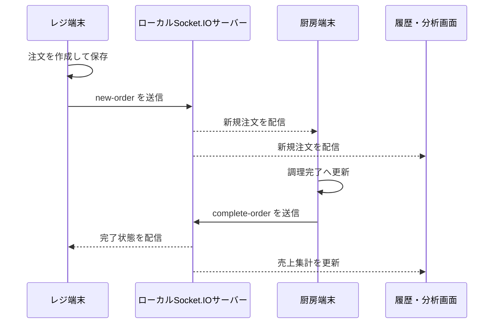

# 文化祭の「次の注文、まだ来てない？」をなくす注文管理システムをつくりました

文化祭の模擬店は、楽しい場所です。しかし、レジと厨房の間では小さな混乱が起こりやすい場所でもあります。

「この注文は厨房に伝わっていますか？」

「これはもう作り始めていますか？」

「さっき、何個売れましたか？」

紙のメモや口頭の伝達でも運営はできます。ただ、列が伸びてくると、注文を正しく・素早く・同じ状態で共有することが急に難しくなります。

そこで高校の文化祭で使うために作ったのが、**Order Management System** です。レジ端末と厨房端末をローカルネットワークで接続し、注文の受付から完成までをリアルタイムで共有するWebアプリケーションです。

- Repository: https://github.com/KTaisei/Order-Management-System

## 目指したのは「立派なPOS」ではなく、当日に迷わない道具です

このプロジェクトでは、複雑な会員管理や決済連携よりも、文化祭当日に必要な流れを優先しました。

1. レジで注文を入力します。
2. 厨房に新しい注文が届きます。
3. 厨房が調理を始め、完了にします。
4. レジと履歴画面で状態を確認します。
5. 売上と注文数を振り返ります。

特別なクラウドサービスを前提にせず、同じWi-Fiに接続した端末同士で動くようにしています。インターネットが不安定な会場でも、会場内のネットワークさえ用意できれば運用できる設計です。



## 端末ごとに、見せるものを変えました

文化祭の運営では、同じ注文データを扱っていても、レジと厨房で必要な画面は異なります。そこでReact Routerを使い、役割ごとに画面を分けています。

| パス | 役割 | 主な内容 |
| --- | --- | --- |
| `/` | レジ端末 | 注文作成、進行中の注文確認 |
| `/kitchen` | 厨房端末 | 新規注文の確認、調理状況の更新 |
| `/display` | 表示用画面 | 注文一覧の表示 |
| `/history` | 履歴・分析 | 注文履歴、売上分析、検索・絞り込み |

「ひとつの画面に全部を置く」のではなく、端末の役割に合わせて情報を絞ることで、忙しいときにも次の操作を見つけやすくしています。

厨房画面では、新しい注文を受付時刻の古い順に並べています。これは、早く来た注文から順に作るという、現場の自然な流れをそのまま画面に反映するためです。

```ts
const sortedNewOrders = [...newOrders].sort((a, b) =>
  new Date(a.createdAt).getTime() - new Date(b.createdAt).getTime()
);
```

小さな並び順ですが、注文が増えたときには大きな安心感につながります。

## Socket.IOで「注文が来た」をすぐに伝えます

リアルタイム同期には Socket.IO を使っています。サーバーはExpressのHTTPサーバーへSocket.IOを重ねた、コンパクトな構成です。

```js
const app = express();
const httpServer = createServer(app);
const io = new Server(httpServer, {
  cors: { origin: true, methods: ['GET', 'POST'], credentials: true }
});
```

注文の作成・更新・完了・取消を、それぞれイベントとして定義しています。

```js
socket.on('new-order', (order) => {
  socket.broadcast.emit('new-order', order);
});

socket.on('complete-order', (order) => {
  socket.broadcast.emit('complete-order', order);
});
```

ここで使っている `socket.broadcast.emit()` は、送信元以外の端末だけにイベントを届ける仕組みです。レジ端末は自分で作った注文をすでに画面へ反映済みなので、自分自身に同じイベントを返して二重登録する必要がありません。

この「自分の画面は即時に更新し、ほかの端末にはイベントを送る」という分担が、操作感と同期の両方をシンプルにしています。

## P2Pを検討した跡と、実際に採用した通信方式

リポジトリには `peerService.ts` もあります。ここでは端末ごとにIDを持たせ、端末の存在を知らせ合うP2P風の通信を検討しています。文化祭のようなローカル運用では、「中央サーバーをできるだけ小さくしたい」「端末同士で直接見つけ合えたら便利かもしれない」という発想が自然に出てきます。

ただし、現行の注文画面はこの `peerService` を利用していません。注文の同期に使っているのは、Socket.IOサーバーを中継するクライアント・サーバー構成です。

`peerService.ts` の実装は、`localStorage` のイベントを使って存在通知やメッセージ送信を模擬する試作です。`localStorage` は同じブラウザ・同じオリジン内での共有を想定した仕組みであり、別々の端末をローカルネットワーク越しに直接つなぐP2P通信にはなりません。

つまり、このプロジェクトの通信方式を正確に表すと、次のようになります。

```text
現在：レジ・厨房・履歴画面 → Socket.IOサーバー → 各端末へ配信
検討：端末発見や直接通信を行うP2P的な仕組み
```

P2Pとして発展させる場合は、WebRTCのDataChannel、ローカルシグナリングサーバー、端末発見の仕組みなどが必要になります。一方で、文化祭当日の安定運用を優先するなら、端末が接続する先を1つにできるSocket.IOの方が、接続確認や障害対応をシンプルにしやすいという利点があります。

## データは、端末内に保存してから共有します

注文データはブラウザの `localStorage` にJSONとして保存しています。

```ts
const ORDERS_KEY = 'festival-orders';

localStorage.setItem(ORDERS_KEY, JSON.stringify(orders));
```

新しい注文には、注文番号、商品一覧、合計金額、状態、受付時刻を持たせています。

```ts
const newOrder: Order = {
  id: getNextOrderId(),
  items,
  status: 'new',
  createdAt: new Date().toISOString(),
  totalPrice
};
```

この方法には、画面を更新してもその端末の注文履歴を復元しやすいという良さがあります。一方で、サーバーに永続データベースがある構成ではありません。端末のブラウザデータを消すと履歴も消えるため、長期的な売上管理には向きません。

しかし、文化祭当日の短期運用では、データベースの準備・管理よりも、早く動かせて、トラブル時に状態を追いやすいことが重要です。用途に対して十分な仕組みを選ぶことも、設計のひとつだと考えています。

## 状態管理はReact Contextへ集めます

注文は、レジ画面、厨房画面、履歴画面のどこからでも参照されます。そこで `OrderContext` を用意し、次の3種類を中心に状態を管理しています。

- `activeOrders`：調理中・未完了の注文です。
- `completedOrders`：完了した注文です。
- `allOrders`：履歴・売上分析に使うすべての注文です。

Socket.IOからイベントを受け取ると、画面用の状態を更新し、同時に `localStorage` へ同期します。

```ts
const handleNewOrder = (order: Order) => {
  setActiveOrders(prev => [...prev, order]);
  setAllOrders(prev => {
    const updated = [...prev, order];
    orderService.syncOrders(updated);
    return updated;
  });
};
```

画面ごとにSocket.IOの処理を書くのではなく、注文に関する処理をContextへ集めたことで、レジと厨房の表示は「現在の注文状態を描く」ことに集中できます。

## 厨房には、注文が届いたことを音でも伝えます

厨房は画面を見続けられる場所とは限りません。そこで、新しい注文の件数が増えたときは、音声ファイルを再生する仕組みを用意しています。

```ts
if (newOrders.length > orderCount && playSound) {
  const audio = new Audio('/notification.mp3');
  audio.play();
}
```

通知音は小さな機能に見えますが、声掛けを減らし、注文を見落としにくくするための大事な導線です。また、厨房画面から音のオン・オフを切り替えられるようにしているため、会場の状況に合わせて使えます。

## 「あとで困る」を減らす履歴と分析画面

注文が終わったあとに気になるのは、「何がどれだけ売れたのか」です。

履歴画面では、注文番号・商品名・受付時刻・状態・調理時間を一覧で確認できます。注文番号や商品名で検索し、状態で絞り込むこともできます。さらにChart.jsと`react-chartjs-2`を用いて、売上の分析画面も作っています。

この画面は、単なる記録ではありません。次回の文化祭で、どの商品を増やすか、どの時間帯に人手を厚くするかを考える材料になります。注文管理は、列をさばくための仕組みであると同時に、次の運営を少し良くするための観察装置にもなります。

## 接続人数を見えるようにします

ローカルネットワークで動かす仕組みでは、「通信できていますか？」が重要な情報になります。サーバー側では接続中のSocket IDを `Set` に保持し、接続・切断のたびに人数を全端末へ配信しています。

```js
const clients = new Set();

io.on('connection', (socket) => {
  clients.add(socket.id);
  io.emit('clientCount', clients.size);
});
```

これにより、端末側では通信状況と接続台数を表示できます。文化祭当日に「厨房の端末がネットワークから外れていないか」を早めに気付くための、ささやかな監視機能です。

## 当日運用で大切にしたいこと

このシステムはローカルネットワークで動くため、当日は次を確認しておくと安心です。

- レジ・厨房・表示用の端末を同じWi-Fiへ接続します。
- Node.jsサーバーを、会場内で到達できる端末で起動します。
- ブラウザからフロントエンドの公開URLへ接続し、同じホスト名の `:3001` でSocket.IOサーバーへ接続できることを確認します。
- 実際のメニューで、注文・完了・取消・音声通知を一度ずつ試します。
- 万一に備え、紙とペンも近くに置いておきます。

技術は失敗しないことが理想ですが、現場では「失敗しても戻れること」も同じくらい大切です。

## 次に改善するとしたら

文化祭向けの最小構成としては動作しますが、次に育てるなら以下を考えています。

1. **サーバー側の永続化を追加します。**  
   SQLiteなどへ注文を保存すれば、端末ごとの `localStorage` に依存せず、再接続時の復元も安定します。

2. **再接続時の全件同期を追加します。**  
   現在はイベントをリアルタイムに配信する構成です。途中から参加した端末へ、サーバーが現在の注文一覧を渡す仕組みがあるとさらに堅牢になります。

3. **通知の再生方法を強化します。**  
   ブラウザの自動再生制限を考慮し、事前の音声許可や視覚的な強調表示を組み合わせると、厨房での見落としを減らせます。

4. **権限を端末ごとに分けます。**  
   レジ・厨房・表示用画面で操作可能な範囲を明確にすると、誤操作にさらに強くなります。

## まとめ

Order Management Systemは、文化祭の注文を「紙のメモ」から「共有できる状態」へ変えるために作ったアプリケーションです。

ReactとTypeScriptで画面を作り、Socket.IOで端末同士をつなぎ、`localStorage`で当日のデータを保持しています。大規模な業務システムではありませんが、実際の行列、厨房、声掛け、売上確認を想像して設計することで、技術が誰かの作業を少し軽くできることを学びました。

文化祭は一日で終わります。しかし、その一日を少しスムーズにするために考えた設計や実装は、その後の開発でもきっと役に立ちます。
