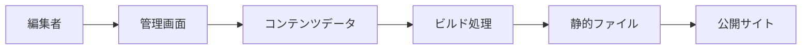
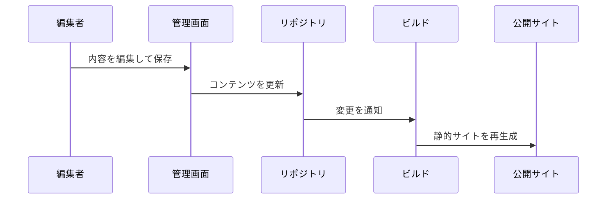
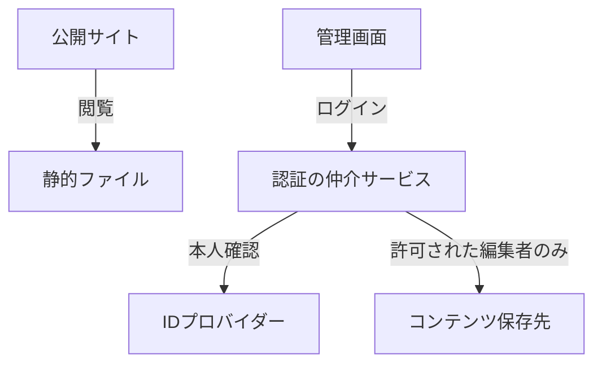
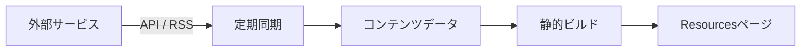
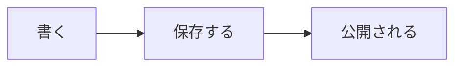
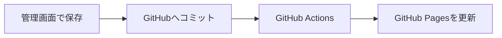
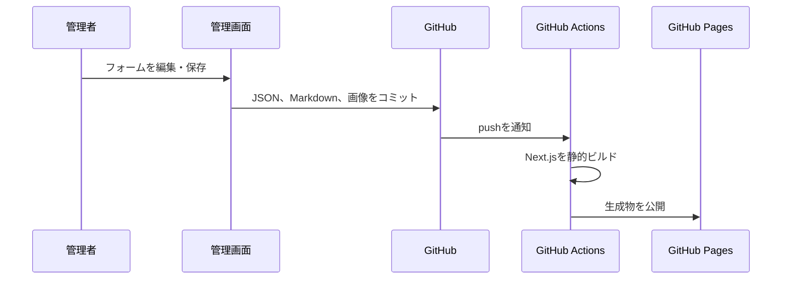
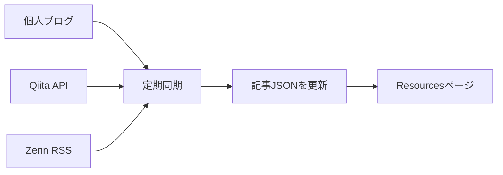

# 静的サイトに管理画面を実装する

静的サイトは速い。軽い。壊れにくい。けれど、ひとつだけ小さな不満がある。

「文章を一文字直すために、コードを開いて、Gitを操作して、再デプロイするのは少し大げさでは？」

この不満を解消するために、静的サイトへ管理画面を足す。するとサイトは、配るための完成品でありながら、自分で育てられる庭にもなる。

本稿では、特定のサービス名やフレームワークに依存せず、静的サイトへ安全な管理画面を加えるときの考え方を整理する。

## 静的サイトは「編集できないサイト」ではない

静的サイトとは、アクセスのたびにサーバーがページを組み立てるのではなく、あらかじめ生成されたHTML、CSS、JavaScript、画像を配信するサイトのことだ。

この仕組みはとてもシンプルだ。公開するだけなら、サーバー側にデータベースも複雑なアプリケーションも必要ない。だから速く、安く、障害にも強い。

一方で、編集機能を考え始めると「静的」と「管理画面」は対立して見える。管理画面は動的、静的サイトは固定。相性が悪そうだ。

しかし実際には、編集する瞬間だけ動的な仕組みを使い、公開時にはまた静的なファイルへ戻せばよい。



公開サイトが毎回データベースに問い合わせる必要はない。編集時だけコンテンツを書き換え、公開時に静的ファイルを作り直す。この分離が、静的サイトに管理画面を持たせる発想の中心になる。

## コンテンツを「コードの外」へ出す

最初の一歩は、文章やプロジェクト情報を画面のコードから分離することだ。

たとえば、プロフィール、記事、イベント情報、リンク集を次のようなデータとして保存する。

```json
{
  "title": "静的サイトに管理画面を実装する",
  "summary": "公開の速さを保ちながら、編集しやすい運用をつくる。",
  "tags": ["Static Site", "CMS", "Automation"]
}
```

保存先はJSONでもMarkdownでもよい。重要なのは、画面の見た目を変えるコードと、伝えたい内容を分けることだ。

この分離には嬉しい副作用がある。

- 同じデータを一覧・詳細・カード表示で再利用できる
- 管理画面が編集する対象を明確にできる
- コンテンツの変更履歴を追いやすい
- 将来、別のデザインや別の出力形式へ移行しやすい

データは、サイトの「中身」。UIは、それを見せる「器」。両者を分けておくと、サイトは急に長生きする。

## 管理画面は、Gitへのやさしい入口になる

個人サイトのコンテンツをGitリポジトリで管理すると、変更履歴、差分、復元、レビューという強力な仕組みを自然に使える。

ただし、Gitは万人向けの編集画面ではない。文章を少し直したいだけなのに、ブランチ、コミット、コンフリクトと聞くと、気軽さはどこかへ消えてしまう。

そこで管理画面を用意する。

編集者はフォームで文章を書き、画像を選び、保存ボタンを押す。裏側では、その変更がデータファイルへ反映され、コミットとして記録される。



編集者の体験は「CMS」。運用の実態は「Git」。この二つの間をなめらかにつなぐことが、GitベースCMSの面白さだ。

## 認証は公開サイトから切り離す

公開ページは誰でも見られる。しかし編集機能まで誰でも使える必要はない。

ここで大切なのは、パスワードやアクセストークンをブラウザのJavaScriptへ埋め込まないことだ。公開された静的ファイルは、原則として誰でも読める。秘密を置く場所ではない。

安全な構成では、認証と権限確認を小さなバックエンドへ切り出す。



この仲介サービスが持つのは、認証に必要な秘密情報と「誰が編集できるか」という判断だけだ。役割を小さく保つほど、攻撃面も運用負担も小さくできる。

## 公開は「保存」の続きにする

管理画面で保存した後に、別の画面を開いて手動で公開ボタンを押す。これは忘れやすい。

理想は、保存が公開までの入口になることだ。

1. 編集者が管理画面で保存する
2. コンテンツの変更が記録される
3. 自動ビルドが走る
4. 新しい静的ファイルが公開される

この流れなら、更新作業は「文章を書いて保存する」だけになる。裏側に自動化を置く理由は、作業を派手にするためではない。人間が忘れなくてよい工程を増やすためだ。

## 外部の発信を集める

自分の発信は、ひとつの場所に収まらないことが多い。技術記事、短いメモ、登壇資料、作品紹介。すべてを手で転記していると、いつか必ず更新漏れが起きる。

そこで、外部サービスの公開APIやRSSフィードを定期的に取得し、サイト用のデータへ変換する。



ここでのコツは、公開ページのブラウザから毎回外部APIを呼ばないことだ。同期処理があらかじめデータを集めておけば、表示は速く、CORSの問題にも悩まされにくい。

外部の発信は散らばっていてもよい。入口だけ、自分のサイトでひとつにすればいい。

## Markdownは文章と構造の中間地点

技術記事では、文章だけでなく、表、コード、図が必要になる。

Markdownは、プレーンテキストの書きやすさと、構造化された見た目の間にある。たとえば表は次のように書ける。

```markdown
| 要素 | 役割 |
| --- | --- |
| コンテンツ | 伝える内容を保持する |
| 管理画面 | 編集の入口になる |
| 自動ビルド | 公開物を再生成する |
```

さらに、Mermaidのような記法を使えば、図もテキストで管理できる。



図を画像として貼るよりも、文章と同じように差分を確認できるのが嬉しい。設計図まで履歴に残る。

## 小さく始める

管理画面付きの静的サイトは、最初から万能CMSにする必要はない。

まずは、プロフィールの文章、プロジェクトの追加、記事の下書きなど、更新頻度が高くて手作業が面倒な部分だけを対象にする。それで十分価値がある。

運用していくうちに、「画像もアップロードしたい」「登壇資料をまとめたい」「外部記事も並べたい」と必要なものが見えてくる。そのとき、コンテンツと表示を分けておけば、機能を足しやすい。

静的サイトの強さは、変わらないことではない。変化を小さく、確実に公開できることだ。

## 実装例：このポートフォリオで採用した仕組み

ここからは、考え方を実際の構成へ落とし込むとどうなるかを紹介する。

このポートフォリオは、Next.jsで静的HTMLを生成し、GitHub Pagesで公開している。編集画面にはDecap CMSを使い、GitHub OAuthの認証だけをCloudflare Workersへ任せている。

| 役割 | 採用した技術 | 担当すること |
| --- | --- | --- |
| 画面 | Next.js | ページとコンポーネントを静的生成する |
| 公開 | GitHub Pages | 生成済みのサイトを配信する |
| 管理画面 | Decap CMS | フォームからコンテンツを編集する |
| 認証 | GitHub OAuth | 管理者の本人確認をする |
| 認証の仲介 | Cloudflare Workers | Client Secretを安全に保持する |
| 自動公開 | GitHub Actions | 保存後にビルド・公開する |
| 記事同期 | GitHub Actions | ブログ、Qiita、Zennを定期取得する |

### コンテンツはJSONで持つ

プロフィールやプロジェクト、スライド画像、登壇資料などは、リポジトリ内の`content/`ディレクトリへJSONとして保存している。

```text
content/
├── profile.json        # 名前と自己紹介
├── site.json           # Hero、About、Contact、フッター
├── projects.json       # プロジェクトと技術記事
├── slides.json         # スライドショー画像
├── presentations.json  # 登壇資料
├── blog.json           # 個人ブログから同期した記事
├── qiita.json          # Qiitaから同期した記事
└── zenn.json           # Zennから同期した記事
```

たとえばプロジェクトは、HomeのPick up、Works一覧、個別の詳細ページで同じ`projects.json`を参照する。編集した内容が複数の画面へ自然に反映されるため、「一覧だけ直したのに詳細が古い」といった事故を防げる。

### プロジェクト記事はMarkdownとして書く

各プロジェクトには、概要だけでなく技術記事を持たせている。本文はMarkdownで書き、見出し、リスト、リンク、コードブロック、表を表示できる。Mermaidのコードブロックも図として描画する。

```markdown

```

この仕組みによって、作品紹介と技術解説を同じページで扱える。ポートフォリオが「完成品の一覧」だけでなく、考え方や設計の記録にもなる。

### 管理画面の保存から公開まで

管理画面で保存すると、Decap CMSがGitHubリポジトリのコンテンツファイルを更新する。`main`ブランチへの変更をGitHub Actionsが検知し、Next.jsを静的ビルドしてGitHub Pagesへ公開する。



管理者に必要なのは、文章を書き、保存することだけだ。ビルドや公開は裏側で進む。

### GitHub Pages特有のパス設計

GitHub Pagesで`ユーザー名.github.io/リポジトリ名/`の形式を使う場合、サイトはドメイン直下ではなくリポジトリ名の配下に公開される。このポートフォリオでは`/official/`配下で公開されるため、Next.jsの`basePath`を設定している。

```ts
const nextConfig = {
  output: 'export',
  trailingSlash: true,
  basePath: '/official',
}
```

この設定を忘れると、CSS、JavaScript、画像、アップロードしたPDFが`/`直下を参照して404になる。静的サイトでは地味だが、とても重要な設定だ。

### 認証に秘密を置かない

管理画面のGitHubログインでは、OAuth Client Secretを公開サイトに置かない。Cloudflare WorkerのSecretとして保存し、WorkerがGitHubとの認可コード交換とログイン名の確認を担当する。

Workerは「許可されたGitHubユーザーか」を確認してから、管理画面へ認証結果を返す。公開ページは静的なまま、編集だけを安全に限定できる。

### 外部記事を自動で集める

Resourcesページでは、個人ブログ、Qiita、Zennの記事を定期的に取得している。同期処理はGitHub Actionsで動き、取得結果をJSONへ保存する。



記事を投稿するたびにポートフォリオへ手入力しなくても、時間が経てば一覧へ反映される。自分の発信を集約するための、小さな自動化である。

## まとめ

静的サイトと管理画面は、相反するものではない。

編集は動的に、公開は静的に。コンテンツはデータとして、変更は履歴として、公開は自動化として扱う。この役割分担をつくると、個人サイトは単なる作品置き場から、書き続け、育て続けられる場所へ変わる。

そして何より、更新することが少し楽しくなる。
