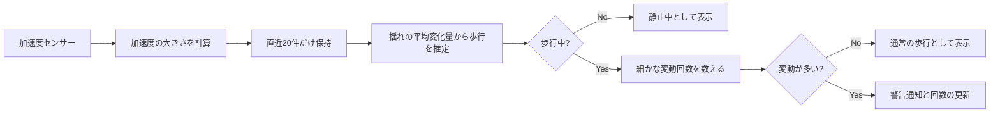

# 加速度センサーだけで「歩きスマホ」を見つけるFlutterアプリをつくった

歩きながらスマートフォンを見る。ほんの数秒なら大丈夫と思っても、その数秒で視界は驚くほど狭くなります。

そこで作ったのが **stophone** です。スマートフォンの加速度センサーから「今は歩いているのか」を推定し、さらにその最中に端末が細かく動いていれば、歩きスマホの可能性として通知するFlutterアプリです。

このアプリは、カメラで人を撮影しません。特別な機械学習モデルも使いません。使うのは、スマートフォンに最初から入っている加速度センサーと、少しの数式だけです。

- Repository: https://github.com/KTaisei/stophone
- Demo: https://ktaisei.github.io/stophone_tsx/

## まず大事なこと：これは「操作そのもの」を見ているわけではない

このアプリが直接観測しているのは、画面でも指でもなく、端末の加速度です。

したがって、厳密には「歩きながらスマホを操作している」と断定する仕組みではありません。**歩行らしい周期的な揺れがあり、そのうえで端末に細かな変動が続いている** 状態を、注意を促すべき候補として扱っています。

この割り切りは大切です。センサーアプリでは、できることを大きく言うより、「何を測り、何を推定しているか」を分けて考える方が、改善の道筋が見えやすくなります。

## 全体の流れ

アプリは起動すると、センサーの購読、通知の初期化、バックグラウンド動作の準備を行います。その後、500ミリ秒ごとに判定を更新します。



コード上では、判定をひとつの巨大な処理に詰め込まず、`_detectWalking()` と `_detectPhoneUsageWhileWalking()` に分けています。人の行動を一気に当てにいくのではなく、まず「歩いているか」、次に「注意が必要そうな揺れか」と段階を分けた設計です。

## 3軸の値を、ひとつの「揺れの強さ」にする

加速度センサーから得られる値は、x・y・zの3軸です。このままでは端末の向きによって解釈が変わりやすくなります。

そこで、各時点の値をベクトルの大きさへ変換しています。

```dart
double magnitude = sqrt(event.x * event.x + event.y * event.y + event.z * event.z);
```

これは、3方向の揺れを一本のものさしにまとめる操作です。端末を縦に持っていても横に持っていても、まずは「どれくらい動いたか」を共通の尺度で扱えます。

利用しているのは `sensors_plus` の `userAccelerometerEvents` です。重力成分を含む生の加速度ではなく、ユーザーの動きに寄った値を受け取ることで、歩行による変化を扱いやすくしています。

## なぜ直近20件だけを残すのか

センサーの値を無限にためる必要はありません。むしろ、今の状態を知りたいなら、古い値は判断を鈍らせます。

stophoneでは、加速度の大きさをリストに追加し、20件を超えた分は先頭から取り除きます。

```dart
_accelMagnitudes.add(magnitude);

if (_accelMagnitudes.length > 20) {
  _accelMagnitudes.removeAt(0);
}
```

これは「短い記憶」を持つ判定器になっています。20件ぶんの窓だけを見るため、歩き始め・立ち止まりといった状態変化に比較的素直に追従できます。

もちろん、20件という値に魔法があるわけではありません。端末やセンサーの取得頻度、ユーザーの歩き方によって適切な幅は変わります。ここは、実際に歩いてログを取りながら調整するべきパラメータです。

## 歩行をどう判定しているか

次に、連続する加速度の大きさ同士の差を取り、その絶対値を合計します。

```dart
double totalVariation = 0.0;
for (int i = 1; i < _accelMagnitudes.length; i++) {
  totalVariation += (_accelMagnitudes[i] - _accelMagnitudes[i - 1]).abs();
}
double averageVariation = totalVariation / _accelMagnitudes.length;
_isWalking = averageVariation > 1.9 && averageVariation < 12.0;
```

発想はシンプルです。

- 揺れがほとんどないなら、机に置いている・座っている・立ち止まっている可能性が高い
- ほどよく変化しているなら、歩行らしい
- 極端に大きいなら、走る・振り回す・乗り物の振動など、歩行とは別の動きかもしれない

このように、下限と上限の両方を置くことで「動いている = 歩いている」と短絡しないようにしています。単純な閾値判定でも、何を除外したいかを考えるだけで、少し賢い判定になります。

## 「歩いている」だけでは通知しない

歩行が検出されたからといって、すぐに警告してしまうと、ただスマホを持って歩いている人まで困らせてしまいます。

そこで二段階目では、隣り合う値の差が感度 `_sensitivity` を超えた回数を数えています。

```dart
int fluctuationCount = 0;
for (int i = 1; i < _accelMagnitudes.length; i++) {
  if ((_accelMagnitudes[i] - _accelMagnitudes[i - 1]).abs() > _sensitivity) {
    fluctuationCount++;
  }
}

_isUsingPhoneWhileWalking = fluctuationCount > 8;
```

ここでは、歩行中に発生する「細かな変化が多い状態」を拾おうとしています。画面を見ながら手元を動かす、持ち方を頻繁に変える、といった挙動は加速度の変化として現れる可能性があります。

ただし、ここもあくまで推定です。荷物を持ち替えたときや、階段・悪路・混雑した場所では、誤検知の可能性があります。だからこそ、この閾値は定数ではなく、将来的にはユーザーごとに調整できる設定にしたいと考えています。

## 500ミリ秒ごとの、小さな見張り番

判定処理は `Timer.periodic` で500ミリ秒ごとに実行しています。

```dart
Timer.periodic(const Duration(milliseconds: 500), (timer) {
  _detectWalking();
  _detectPhoneUsageWhileWalking();
  setState(() {});
});
```

この間隔は、リアルタイム性と消費電力の折衷案です。短すぎれば反応は速くなりますが、画面更新や計算が増えます。長すぎれば通知が遅れます。

歩きスマホへの注意は、数ミリ秒を競う分野ではありません。一方で、数十秒遅れてから通知しても意味が薄くなります。500ミリ秒は「今の状態を追う」には十分短く、「常に全力で動き続ける」ほどではないバランスを狙った値といえます。

## 通知はUIではなく、行動のきっかけにする

検知時には、`flutter_local_notifications` を通じて高優先度のローカル通知を出します。

```dart
await flutterLocalNotificationsPlugin.show(
  0,
  '警告',
  '歩きスマホをやめてください！',
  notificationDetails,
);
```

画面上には現在の状態と警告回数も表示します。これはデバッグ表示でもあり、ユーザーがアプリの判断を理解するためのフィードバックでもあります。

通知だけが突然届くと、「なぜ？」となります。`歩行中 / 静止中`、`歩きスマホ検知 / スマホ操作なし`、`警告回数` を並べることで、センサーの曖昧さを少しでも見える形にしています。

## バックグラウンドでも動かす難しさ

安全を促すアプリは、画面を開いているときだけ動いても価値が半減します。そこでAndroid向けに `flutter_background` を使い、バックグラウンド実行の初期化と常駐通知の準備を行っています。

```dart
const androidConfig = fb.FlutterBackgroundAndroidConfig(
  notificationTitle: '歩きスマホ検知中',
  notificationText: 'アプリはバックグラウンドで動作中です',
  notificationImportance: fb.AndroidNotificationImportance.high,
);
```

バックグラウンド処理は便利ですが、OSの電池最適化、通知権限、機種差の影響を受けます。実装できた時点で終わりではなく、実機で「画面を閉じた後もどこまで動くか」を検証することが重要になります。

## このアプリの面白さは、アルゴリズムを小さく始めていること

歩きスマホ検知というテーマだけを見ると、AIによる行動認識を思い浮かべるかもしれません。しかし最初の一歩としては、センサー値を観察し、短い窓で変化量を計算し、二段階のルールに落とす方法はとても良い方法です。

なぜなら、誤判定が起きたときに理由を追えるからです。

- 歩行の範囲が広すぎたのか
- 変動の感度が高すぎたのか
- 観測する時間窓が短すぎたのか
- そもそも加速度だけでは区別できない行動なのか

モデルがブラックボックスでないぶん、改善がそのまま次の実験になります。センサーアプリは、日常の動きを数値に翻訳してみる小さな研究室のようで面白いです。

## 次に改善するとしたら

コードから見える次の発展案は、次のとおりです。

1. **通知のクールダウンを入れる**  
   現状は判定周期ごとに条件を満たすと通知・警告回数の更新が起き得る。たとえば30秒のクールダウンを置けば、通知が連続するストレスを減らせる。

2. **画面状態と組み合わせる**  
   加速度だけでは「端末を持って歩いている」と「画面を見ている」を区別しにくくなります。画面の点灯状態やアプリの利用状態と組み合わせると、判定の意味をより明確にできます。ただし、OS権限とプライバシーへの配慮が必要になります。

3. **個人ごとのキャリブレーション**  
   歩幅も端末の持ち方も人によって異なります。最初に数十秒歩いてもらい、平均的な変動幅を基準に感度を調整する仕組みがあると、閾値を万人向けに固定するより自然です。

4. **ログを残して判定を検証する**  
   時刻・加速度の要約値・判定結果だけを匿名で保存すれば、誤検知がどの場面で起きるかを振り返れます。データを増やしてから、必要なら軽量な機械学習へ進むこともできます。

## まとめ

stophoneは、加速度センサーの値をただ表示するアプリではありません。連続する揺れから歩行を推定し、さらに変動の多さから注意すべき状態を推定し、通知へつなげるアプリです。

派手な技術はなくても、センサー、短期バッファ、変化量、閾値、通知、バックグラウンド実行を組み合わせると、日常の安全に関わる体験をつくれます。

スマートフォンは便利です。だからこそ、便利さに視線を奪われすぎないための技術も、同じスマートフォンの中に作っていけます。
